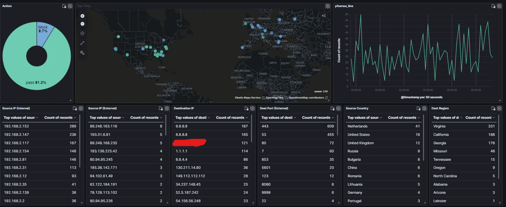

## Fixing Kibana Map
This is using Elasticsearch and Kibana version 7.17

Issue:
Geospatial type (geo_point) not present even though geoip is being parsed with logstash.
Looking at the mapping shows
```
GET so-pfsense-*/_mapping 
...
                "latitude" : {
                  "type" : "float"
                },
                "location" : {
                  "properties" : {
                     "lat" :
                      "type": "float",
                     "lon" :
                      "type": "float"
                },
                "longitude" : {
                  "type" : "float"
```

Solution:
Create a new index mapping
1. Copy the contents from 'GET so-pfsense-*/_mapping' and paste into kibana console
2. Replace the first line that shows the indice name with "template" and above that add '"index_patterns": ["so-pfsense-*"],'
3. Additionally add a PUT to store you index template above the first curly brace.
   ```
   PUT _index_template/pfsense
   { 
     "index_patterns": ["so-pfsense-*"], 
     "template" : {
       "mappings" : {
         "properties" : {
           "@timestamp" : {
             "type" : "date"
   ```
4. Locate the location property, remove the properties with lat/lon fields and just give it a "type": "geo_point" to look like the following:
   ```
   "latitude" : {
   "type" : "float"
   },
   "location" : {
   "type": "geo_point"
   },
   "longitude" : {
   "type" : "float"
   ```
 
